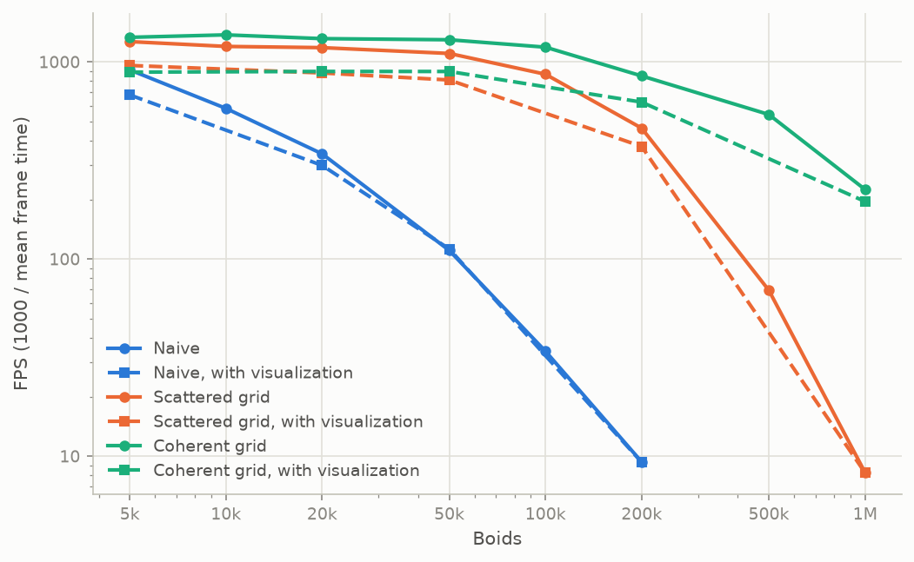
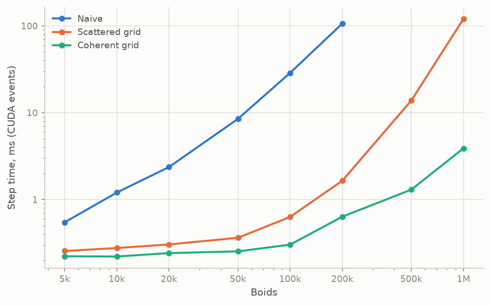
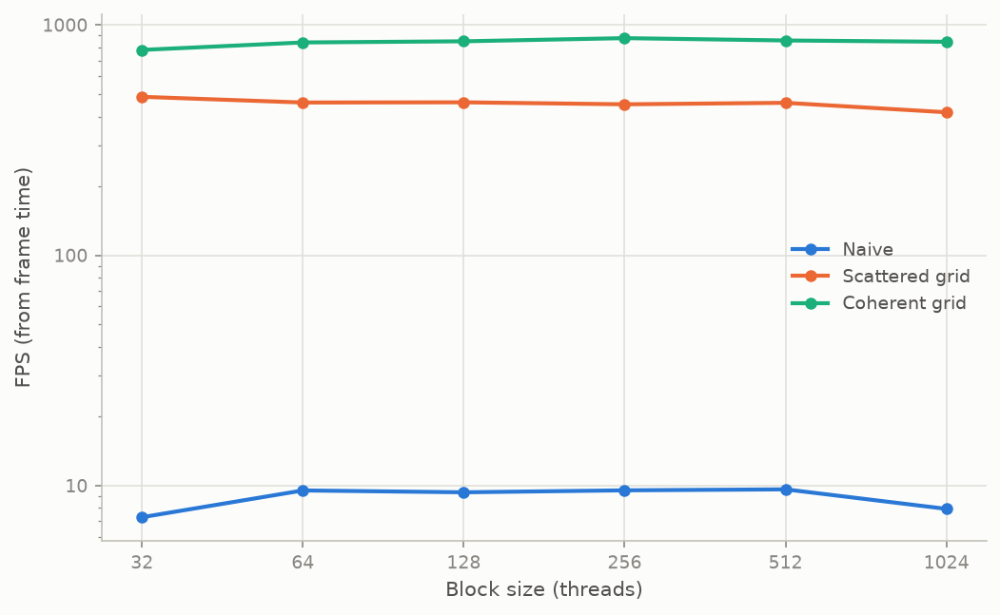
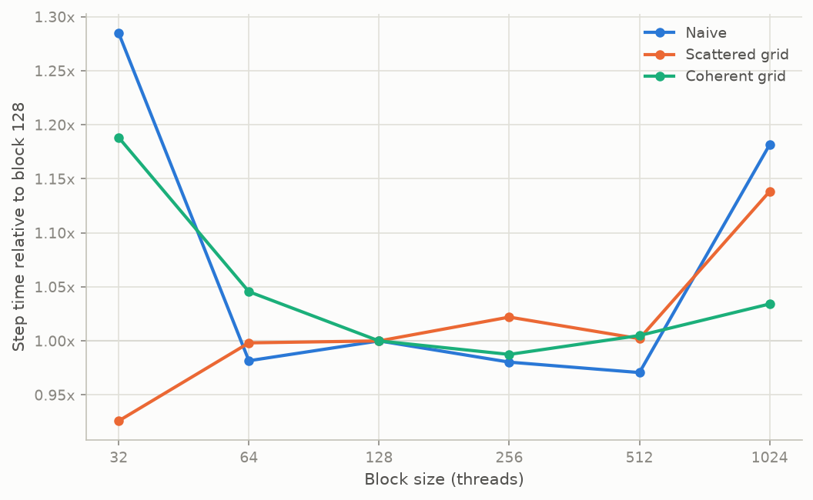
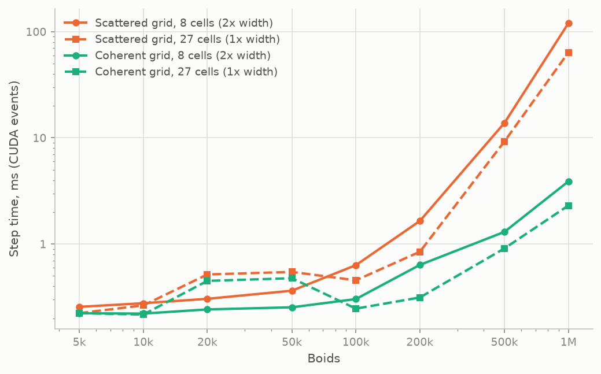
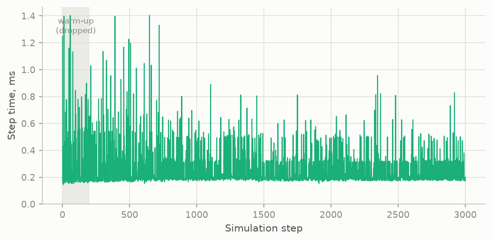

(note that Y axis is log-based)**University of Pennsylvania, CIS 5650: GPU Programming and Architecture,
Project 1 - Flocking**

* Yichen Huang
    - [LinkedIn](https://www.linkedin.com/in/yichen-huang-970b582bb/), [personal website](https://as7tesia.com/)
* Tested on: Windows 11, AMD Ryzen 5950X @ 4.3GHz 64GB, RTX 3090 24GB

  

  
  
  

Above are simulations of 200,000 boids running at 800+fps, though we will later see why fps is not a great measurement for performance here.

## Overview
This project implements the Craig Reynolds' boids flocking simulation, where each particle represents a boid and their positions are updated based on the 3 rules of cohesion, separation, and alignment. 

### Implemented Approaches

1. Naive O(N^2) neighbor search that iterates through every other particle for each particle.
2. Scattered uniform grid. Sort boid indices by cell, find each cell's start/end, and find neighbor boids within the max rule distance.
3. Coherent uniform grid. Same as scattered, but positions and velocities are shuffled into cell order first so the neighbor loop reads contiguous memory instead of going through an index array and doing random memory access. 
* The three velocity kernels share the same rule math (`accumulateNeighbor` / `finalizeVelocityChange`), so any timing difference between them is the neighbor loop, not the rules.
* Toggles are at the top of `src/main.cpp`: `UNIFORM_GRID`, `COHERENT_GRID`, `VISUALIZE`, plus a `PROFILE` switch I added for the measurements below.

## Performance Measurement

I figured just watching the FPS counter is not a great way to measure performance, also the FPS counter in the window title turned out to be an inaccurate indicator. With 50k boids the coherent step takes 0.25 ms of GPU time, but one loop iteration takes 0.77 ms. The other half millisecond is the GL buffer stuff, the window title update and event polling.

So I added a `PROFILE` macro in `main.cpp`:

* A `cudaEvent` pair around the simulation step call, synced every frame, gives the GPU time of just the step. This is the "step ms" everywhere below.
* The wall-clock time of the whole loop iteration is also recorded per frame. FPS = 1000 / mean of that. Pretty much same thing as what the title bar fps measures but average throughout the entire run.
* Both go into a preallocated vector and get written as a CSV when the run exits, so the logging cost is insignificant during the run. The program runs a fixed number of steps (label, N and step count come from the command line) and closes itself.
* `glfwSwapInterval(0)` under `PROFILE` so I can leave my Nvidia vsync settings at "application based" and no need to toggle global setting. (Definitely did not do this because I would forget to turn it back on when gaming and get bad tearing)

Setup for every performance graph here: Release build, block size 128 and cell width 2x the max rule distance unless stated, `VISUALIZE 0` unless stated, 3000 steps per run with the first 200 thrown away as warm-up (naive at 200k only runs 300 steps because it would take 10 years to finish 3000 steps). Because initial positions are seeded deterministically, so step k is the same world in every mode. Also other programs were minimized when running, as I noticed that they were eating around 20% of my GPU.

Scripts and raw data: `profiling/run_sweep.ps1` runs a sweep, `profiling/analyze.py` makes the tables and graphs, `profiling/raw/` has every per-frame CSV, `profiling/summary.md` has every number.

Note: performance powershell and python scripts were created with help of AI
## Results

### Boid count (note that Y axis is log-based)

* **Naive** Scales very poorly once the GPU is full. Below 20k it grows slower than that because 5k boids is only 40 blocks of 128 threads and the 3090 has 82 SMs, so half the GPU is idle.
* **Both grid modes are pretty much flat until about 100k.** My guess would be that around 0.3ms is the cost for launching the kernels plus the thrust sort, and at these sizes the actual work is smaller than the overhead.
* **Scattered falls off a cliff between 200k and 500k**: 1.6 ms, then 13.8, then 120. Coherent goes 0.64, 1.3, 3.9 over the same range. I believe this has to do with the cache size of my GPU. More details in the Coherent vs Scattered section below.
* **Visualization on** doesn't  (and shouldn't) change the step time at all, it just adds the draw and swap to each frame. At 50k that's about 0.3 ms per frame, which is why FPS drops from 1300 to 900 while the step is unchanged.

### Block size (note that Y axis is log-based)

Data are collected at 200k boids, no visualization. Only parameter changing here is the block size..

It seemed weird that only scattered did well on blocksize of 32, so I used `cuobjdump --dump-resource-usage` to check occupancy. An SM on the 3090 holds at most 16 resident blocks and 1536 resident threads (48 warps), so 128 blocksize seemed reasonable to be the best performance configurationt. Registers could be a third cap but two neighbor-search kernels use 40 registers per thread, naive uses 35, and none of them use shared memory. 1536 x 40 = 61,440 fits in the 65,536-register file, so registers are not the issue here and occupancy comes down to block size alone.
| Block size | Resident blocks per SM | Resident warps | Occupancy | Coherent 200k, ms | Coherent 1M, ms | Scattered 200k, ms | Scattered 1M, ms |
|---|---|---|---|---|---|---|---|
| 32 | 16 (block cap) | 16 | 33% | 0.755 | 6.33 | 1.527 | 102.1 |
| 64 | 16 (block cap) | 32 | 67% | 0.665 | 4.18 | 1.646 | |
| 128 | 12 (thread cap) | 48 | 100% | 0.636 | 3.89 | 1.649 | 120.2 |
| 256 | 6 | 48 | 100% | 0.628 | 3.87 | 1.685 | |
| 512 | 3 | 48 | 100% | 0.639 | 3.85 | 1.652 | |
| 1024 | 1 | 32 | 67% | 0.657 | 3.94 | 1.877 | |

* 3090 allows 16 resident blocks per SM, so 32-thread blocks cap an SM at 16 warps out of 48, only a third of full occupancy. Which means there are fewer warps to hide memory latency behind, which performance data supports, but **except for Scatter**. With Scatter approach, 32 is its fastest block size. Perhaps this could be due to the fact that Scatter is so memory bound that less warps in flight actually alleviates the cache thrashing issue, and that outweighs the occupancy loss, although this is not verified conclusion.
* It also makes sense to see thtat performance gets worse at 1024 block size again, since its occupancy is only 2/3, and a big block size could cause more imbalance inside a block, causing finished warps to wait on the slowest warp.
### Coherent vs scattered

- At 50k and below there's no significant difference. Probably becauses there are so little GPU work, and the extra shuffle kernel in coherent costs about the same as what it saves.

- However as the boid count ramps up we start to see a much more significant performance gain for coherent. This is likely due to the fact that higher boid count leads to much bigger arrays that does not fit comfortably in cache anymore, so many random neighbor read would lead to a DRAM access.
- By doing some calculations: 3090 has 6MB of L2 Cache. At 50K boids at `pos` array for exmaple would take 50K * 12 bytes = 0.8MB. With all the other arrays this probably still fits under the 6MB L2 cache. However, at 200k boids, `pos` array would take 200k * 12 bytes = 2.4MB of data, plus other arrays it just does not fit inside the 6MB L2 cache.
 
### 27 vs 8 neighbor cells (note that Y axis is log-based)

For some reason both approaches have bad performance at 20K and 50K with the 27 cells approach. I still have no clue why this is the case. I used nvidia-smi to check GPU clock frequency during the run, as I thought perhaps the low boid count does not kick the GPU upto a higher clock speed, but the clock speed were pretty much identical between all boid counts.

As for the 27 vs 8 cells performance overall:

- 27 cells performed consistently better above 100K boids, and worse at 20K and 50K. 

- I still have no clue why it would perform better at 100K and 200K compared to 20K and 50K. I used nvidia-smi to check GPU clock frequency during the run, as I thought perhaps the low boid count does not kick the GPU upto a higher clock speed, but the clock speed were pretty much identical between all boid counts.
- It is true that 27 cells approach pays for more start/end lookups, however, it also reduces the wasteful look ups because it checks a smaller area. Consider the situation that a boid is checking is neighbors, and there is a neighbor within the 8 cell distance, but it is actually outside of the maximum rule radius. Neighbors like this are looked up but diched anyways at the end. By doing 27 cells, we reduce the frequency that this kind of neighbor look up happens, beacuse we are searching within a tighter bound. This explains why on higher boid counts 27 cell approach wins more, because the denser the boids, the more neighbor lookups it saves with the tighter bound.

### Frame time spikes

Because every frame is logged I could look at the distribution, and there are performance spikes in both grid based approaches. I have not looked into why this is the case.
## Notes

* `CMakeLists.txt` is unchanged.
* `PROFILE` is 0 by default in `main.cpp`, which is the normal interactive build with none of the profiling code compiled in. Set it to 1 to reproduce the measurements: the exe then takes `label N steps` on the command line, runs that many steps, writes `label.csv` and exits.
